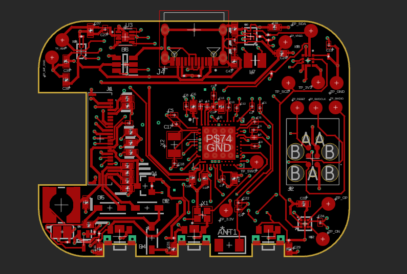
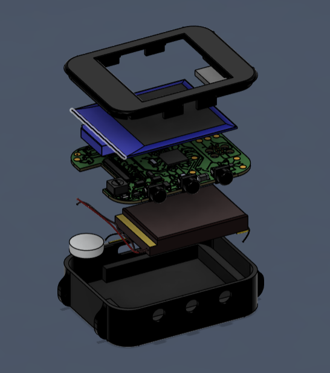
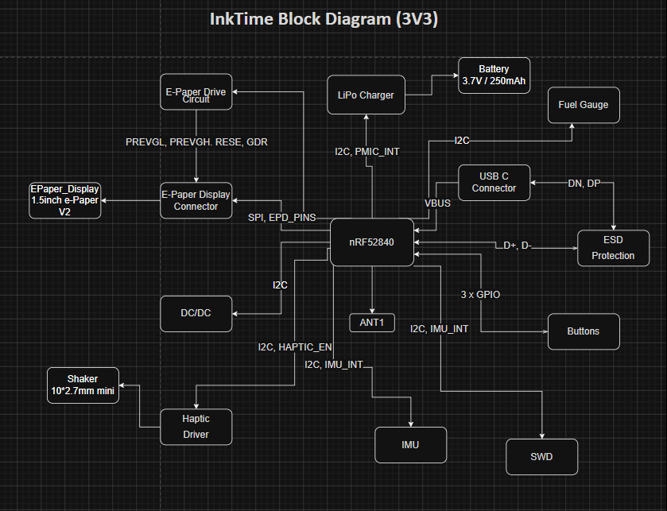

# Proiect_InkTime

Schematic, PCB design si 3D modeling pentru ceasul InkTime in cadrul proiectului de la materia TSC.

## Diagrama Bloc

Diagrama bloc a proietului (o varianta destul de minimala, dar suficienta pentru a intelege cum interactioneaza componentele intre ele) este prezenta in folder-ul root proiectului in varianta HTML si a fost realizata folosind [www.drawio.com](https://www.drawio.com/).

## BOM
Un Bills of Materials cu componentele folosite in cadrul acestui proiect.

### Componente active
 
| Component | Part Number | Package | Function | JLCPCB Part | Datasheet |
|-----------|------------|---------|----------|-------------|-----------|
| MCU | nRF52840-QIAA-R | aQFN73 (7x7) | Microcontroller + BLE + USB | [C190794](https://jlcpcb.com/partdetail/Nordic_Semicon-NRF52840_QIAA_R/C190794) | [Datasheet](https://infocenter.nordicsemi.com/pdf/nRF52840_PS_v1.8.pdf) |
| Charger / Power Path | BQ25180YBGR | DSBGA-8 | Li-Ion/LiPo charger with power path | [C3682423](https://jlcpcb.com/partdetail/TexasInstruments-BQ25180YBGR/C3682423) | [Datasheet](https://www.ti.com/lit/ds/symlink/bq25180.pdf) |
| Buck-Boost Regulator | RT6160AWSC | WLCSP-15 | 3.3V system rail regulator | [C7065276](https://jlcpcb.com/partdetail/Richtek_Tech-RT6160AWSC/C7065276) | [Datasheet](https://www.richtek.com/assets/product_file/RT6160A/DS6160A-05.pdf) |
| Fuel Gauge | MAX17048G+T10 | DFN-8 (2x2) | Battery SOC monitoring | [C2682616](https://jlcpcb.com/partdetail/AnalogDevices-MAX17048G_T10/C2682616) | [Datasheet](https://www.analog.com/media/en/technical-documentation/data-sheets/MAX17048-MAX17049.pdf) |
| Accelerometer | BMA421 | LGA-12 (2x2) | Step counting + motion wake | [C5242966](https://jlcpcb.com/partdetail/Bosch_Sensortec-BMA421/C5242966) | [Datasheet](https://www.bosch-sensortec.com/media/boschsensortec/downloads/datasheets/bst-bma421-ds004.pdf) |
| Haptic Driver | DRV2605LDGSR | VSSOP-10 | ERM motor driver with effects library | [C527464](https://jlcpcb.com/partdetail/TexasInstruments-DRV2605LDGSR/C527464) | [Datasheet](https://www.ti.com/lit/ds/symlink/drv2605l.pdf) |
| PFET (EPD power) | SI2301CDS | SOT-23 | E-paper display power gating | [C10487](https://jlcpcb.com/partdetail/Changjiang_Electronics_Tech_CJ-SI2301CDS/C10487) | [Datasheet](https://www.vishay.com/docs/68749/si2301cds.pdf) |
| USB ESD Protection | USBLC6-2SC6Y | SOT-23-6 | ESD protection on USB data lines | [C7519](https://jlcpcb.com/partdetail/Stmicroelectronics-USBLC6_2SC6Y/C7519) | [Datasheet](https://www.st.com/resource/en/datasheet/usblc6-2.pdf) |
 
### Conectori & Componente electromecanice
 
| Component | Part Number | Package | Function | JLCPCB Part | Datasheet |
|-----------|------------|---------|----------|-------------|-----------|
| FPC Connector (Display) | Molex 503480-2400 | 24-pin 0.5mm FPC | E-paper display FPC connection | [C2857160](https://jlcpcb.com/partdetail/Molex-5034802400/C2857160) | [Datasheet](https://www.molex.com/en-us/products/part-detail/5034802400) |
| USB Type-C Connector | KH-TYPE-C-16P | 16-pin SMD | USB charging + data | [C2765186](https://jlcpcb.com/partdetail/Kinghelm-KH_TYPE_C_16P/C2765186) | [Datasheet](https://datasheet.lcsc.com/lcsc/2012121836_Kinghelm-KH-TYPE-C-16P_C2765186.pdf) |
| Buttons (x3) | EVP-AKE31A | SMD tactile | Up / Down / Enter navigation | [C2845028](https://jlcpcb.com/partdetail/Panasonic-EVP_AKE31A/C2845028) | [Datasheet](https://industrial.panasonic.com/cdbs/www-data/pdf/ATV0000/ATV0000CE3.pdf) |
| SWD Debug Header | TC2030-IDC | Tag-Connect 6-pin | SWD programming + debug | - | [Datasheet](https://4donline.ihs.com/images/VipMasterIC/IC/TGCN/TGCN-S-A0008988129/TGCN-S-A0008988129-1.pdf?hkey=61A2E4C270F0397D049F8F05BD4F1054) |
| Antenna | 2450AT18B100E | SMD 3216 | 2.4 GHz BLE chip antenna | [C5179427](https://jlcpcb.com/partdetail/Johanson_Technology-2450AT18B100E/C5179427) | [Datasheet](https://www.johansontechnology.com/datasheets/2450AT18B100/2450AT18B100.pdf) |
 
### Componente Pasive
 
| Component | Value | Package | Qty | Function |
|-----------|-------|---------|-----|----------|
| Capacitors (EPD) | 1uF/50V | 0402 | 9 | E-paper driver capacitors |
| Capacitors (decoupling) | 100nF | 0201 | 5 | MCU + peripheral decoupling |
| Capacitors (crystal load) | 12pF | 0201 | 4 | 32MHz + 32.768kHz crystal loads |
| Capacitors (bulk) | 4.7uF | 0402 | 4 | MCU power rail bulk decoupling |
| Capacitors (charger) | 1uF | 0402 | 3 | BQ25180 CIN/CSYS/CBAT |
| Capacitors (power) | 22uF | 0402 | 2 | RT6160 input capacitors |
| Capacitors (USB) | 4.7uF | 0402 | 1 | DECUSB capacitor |
| Resistors (I2C pull-up) | 10k | 0201 | 2 | I2C SDA/SCL pull-ups |
| Resistors (USB CC) | 5.1k | 0201 | 2 | USB Type-C CC1/CC2 pull-downs |
| Inductor (DC/DC) | 10uH | 0402 | 1 | nRF52840 REG1 DC/DC inductor |
| Inductor (buck-boost) | 0.47uH | 2012 | 1 | RT6160 power stage inductor |
| Crystal | 32 MHz | 2016 | 1 | HFXO for MCU + radio |
| Crystal | 32.768 kHz | 3215 | 1 | LFXO for RTC timekeeping |
 
### Componente asamblate manual
 
| Component | Description | Datasheet |
|-----------|-------------|-----------|
| E-Paper Display | 1.54" 200x200 e-paper panel (connected via 24-pin FPC) | [Datasheet](https://www.tme.eu/Document/0ca57a8ffbcd57b5bca53252eb9d6ec3/WSH-12561.pdf)
| LiPo Battery | 3.7V / 250mAh lithium polymer cell | [Datasheet](https://www.tme.eu/Document/b9e12bf26ad0ba929a22ab5d58f022cd/AKY0106.pdf) |
| ERM Motor | Vibration motor (LCM1027B3605F, wire-soldered) | [Datasheet](https://www.mouser.com/pdfDocs/ProductOverview_DFRobot-FIT0774.pdf?srsltid=AfmBOorF7wbF3rhjcccF6FYMm4IWaUvm-yoIZHtvcCPKd2GPxZIuuKFv) |
| Case | 3D-printed case (SLS/MJF or FDM prototype) | [Soon](https://www.youtube.com/watch?v=xm3YgoEiEDc&list=RDxm3YgoEiEDc&start_radio=1) |

## Descrierea functionalitatii hardware

### **I2C**: LiPo Charger, DC/DC, IMU, Fuel Gauge, Haptic Driver;
### **SPI**: E-Paper Display Connector;

### Sheet1:
- **LiPo Charger** este folosit pentru a incarca bateria;
- **DC/DC** este un stabilizator de tensiune si este folosit pentru a oferi o tensiune stabila de 3V3 intregii placi;
- **IMU** este un accelerometru, fiind utilizat pentru determinarea acceleratiei pe cele 3 axe, numararea pasilor, etc;
- **nRF52840** este microcontroller-ul placutei si controleaza si orchestreaza intreaga functionalitate a acesteia;
- **SWD** - este mufa pentru conectorul de debug;

### Sheet2:
- **E-Paper Drive Circuit** este folosit pentru a controla display-ul si a oferii tensiuni de alimentare potrivite;
- **E-Paper Display Connector** - conectorul ce face legatura intre display si restul sistemului;
- **Fuel Gauge** este o componenta care indica nivelul de incarcare al bateriei;
- **USB C Connector** este mufa usb;
- **ESD Protection** este un modul ce protejeaza placuta de descarcarile elctrostatice ce pot aparea in utilizarea zilnica a ceasului;
- **Haptic Driver** este folosit pentru a controla vibratia shaker-ului;
- **Buttons** vor indeplini anumite functii in interfata cu utilizatorul (mai multe detalii in implementarea software);

## Descriere pini nRF52840 (randul de sus, sens invers trigonometric)

| Pin | Descriere |
|-----------|-------------|
| VDD | alimentarea la 3V3 |
| DCC | power regulation | 
| DEC4 | power regulation |
| VSS | GND |
| P0.31/AIN7-4 | nefolosit |
| P0.02/AIN0 | SCK - pinul de clock pentru protocolul SPI prin care comunica conectorul de display |
| P0.02/AIN0 | MOSI - master output slave in, folosit pentru comunicarea SPI |
| P1.15-12 | nefolosit |
| DEC2 | GND, power regulation |
| P1.12-11 | nefolosit |
| VDD | 3V3 |
| XC2, XC1 | pini pentru sursa de ceas X1 de 32MHz |
| DEC3 | GND |
| DEC6 | power regulation |
| VSS_PA | alimentare antena |
| ANT | pin folosit pentru legarea la antena |
| P0.10/NFC2 | pin folosit probabil pentru ca Fuel Gauge sa anunte microcontroller-ul cand tensiunea bateriei ajunse sa fie mai mica decat un prag anume |
| P0.09/NFC1 | nefolosit |
| DEC5 | GND, power regulation |
| P1.07-03 | nefolosit |
| P1.02 | buton down |
| P1.01 | controleaza tensiunea de alimentare a display-ului prin driver |
| SWDIO, SWDCLK | pini utilizati pentru depanarea si programarea microcontroller-ului |
| VDD | 3V3 |
| VSS_PAD | GND |
| P1.00 | SWO - pin utilizat pentru depanarea si programarea microcontroller-ului |
| P0.25-19 | nefolosit |
| P.18/RESET | maretul pin de reset |
| P0.17, P0.16, P0.15 | pini folositi pentru tranzactionarea cu display-ul |
| P0.13, P0.14| buton ent, buton up |
| D-, D+ | pini folositi la tranzactionarea datelor de la USB; folosesc tranmisie diferentiala |
| VBUS | alimentarea la 5V a unui USB |
| DEC3V3 | GND (ciudat putin, SoC interesant) |
| DCCH | nefolosit |
| VDDH, VDD | 3V3 |
| P0.12 | enable pentru driverul haptic |
| P0.11 | folosit pentru atentiona microcontroller-ul de posibile hazarde de alimentare; este controlar de Lipo Charger |
| P1.09 | nefolosit |
| P1.08, P0.08 | pini de intrerupere pentru modulul de IMU |
| P0.07, P0.06 | pini folositi de protocolul I2C |
| P0.05/AIN3 | chip select pentru display |
| P0.04/AIN2, P0.27, P0.26 | nefolosit |
| XL2, XL1 | pini pentru sursa de ceas X2 de 32KHz |
| DEC1 | GND, power regulation |

## Aspecte de design

- am ales sa realizez PCB-ul pe 4 straturi. Am un plan top, unul bottom, un plan de masa pe layer-ul de sub top si un plan de 3V3 pe layer-ul de deasupra lui bottom;
- am pozitionat antena in partea de jos a placii, langa butoane si am decupat straturile de cupru de sub aceasta;
- am folosit via in pad si am din aceasta cauza cateva erori pe care le-am acceptat deoarece era singura solutie viabila;
- am ales sa am un nivel de detaliu mediu in cadrul modelarii 3D a bateriei, display-ului si shaker-ului
- am conectat shaker-ul si bateria prin fire la test pad-urile asociate lor;
- am curbat conectorul flex al display-ului pentru a se potrivi in concectorul de pe PCB folosind comanda bend pentru metal sheets;
- am folosit niste inlocuitori pentru modelul 3D al unor piese, deoarece nu am putut identifica un model exact al footprint-ului din schematic sau footprint-ul nu era unul specificat tehnic (ex: PERFECT_0402, JUMPER_SJ, etc);
- am realilzat un exploded view vertical, in care sunt prezente piesele dezasamblate ale ceasului;
- am inclus cateva screenshot-uri de pe parcursul dezvolatarii proiectului in folderul Images;

## Observatii personale

Proiectul a fost extrem de muncitoresc si plin de frustrari din mai multe puncte de vedere. In primul rand, nu am fost "scoliti" in a utiliza la capacitate scazuta spre medie facilitatile de care dispune aplicatia Fusion Autodesk, fapt ce a dus la un loop aproape infinit de vizionat tutoriale si incercari repetate inutile de trage o curba in spatiu pentru desenarea firelor de legatura (un umil exemplu). Mi-as fi dorit ca laboratoarele sa prezinte mai in detaliu functionalitatile esentiale in realizarea proiectului si consider ca nu este o virtute faptul ca ne-am descurcat singuri, deoarece timpul pe care il avem este deja extrem de limitat (da, am invatat multe, pe cont propriu sau prin viu grai, dar ar fi fost mult mai usor sa fim instruiti macar putin mai mult).

Dupa aceasta critica constructiva, as dorii totusi sa felicit ideea de a propune un astfel de proiect. A fost un proces interesant de design, atat la nivel de PCB, cat si modelare 3D, si simt ca m-a ajutat sa ma dezvolt pe plan ingineresc. Am invatat sa ma descurc singur, sa incerc, m-am enervat de multe ori, dar intr-un final am reusit sa fixez un fir exact in pozitia in care imi doream.
Fun fact, am avut un bug in fusion care imi bloca coada de task-uri si ajunsesem sa am in jur de 240 de task-uri in processing, fapt ce imi bloca orice incercare de a exporta un fisier 3D. Din fericire, am rezolvat aceasta problema printr-o comanda text inteligenta.
